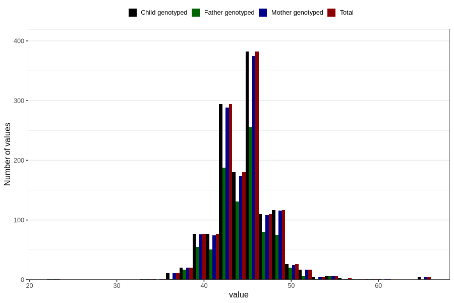

# biparietal_diameter_fetus2
Variable mapping to `BPD_F2` in `Ultralyd`.
- Number of values:

| Value | Total | Child genotyped | Mother genotyped | Father genotyped |
| ----- | ----- | --------------- | ---------------- | ---------------- |
| Missing | 79468 | 79468 | 74716 | 52267 |
| Non-missing | 1338 | 1338 | 1308 | 896 |
| 25th percentile | 43 | 43 | 43 | 43 |
| 50th percentile | 45 | 45 | 45 | 45 |
| 75th percentile | 46 | 46 | 46 | 46 |
| Mean | 44.5553064275037 | 44.5553064275037 | 44.5504587155963 | 44.4888392857143 |
| Standard deviation | 3.35534574141048 | 3.35534574141048 | 3.35842415372225 | 3.12028654909188 |
| N | 1338 | 1338 | 1308 | 896 |

