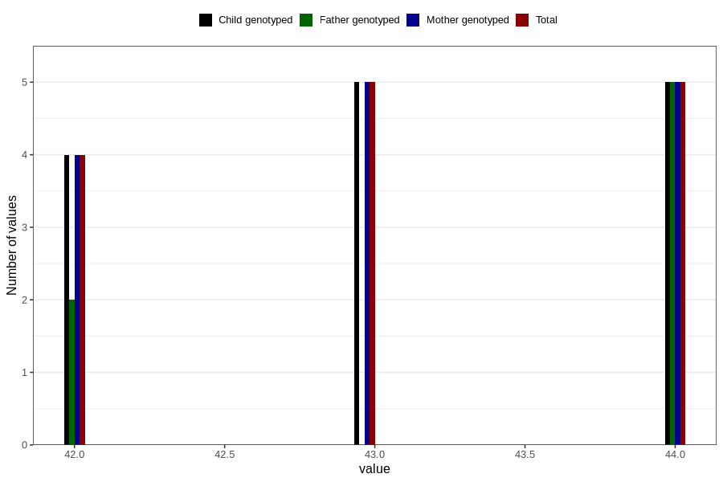

# biparietal_diameter_fetus3
Variable mapping to `BPD_F3` in `Ultralyd`.
- Number of values:

| Value | Total | Child genotyped | Mother genotyped | Father genotyped |
| ----- | ----- | --------------- | ---------------- | ---------------- |
| Missing | 80792 | 80792 | 76010 | 53156 |
| Non-missing | 14 | 14 | 14 | 7 |
| 42 | 4 | 4 | 4 | 2 |
| 43 | 5 | 5 | 5 | 0 |
| 44 | 5 | 5 | 5 | 5 |

