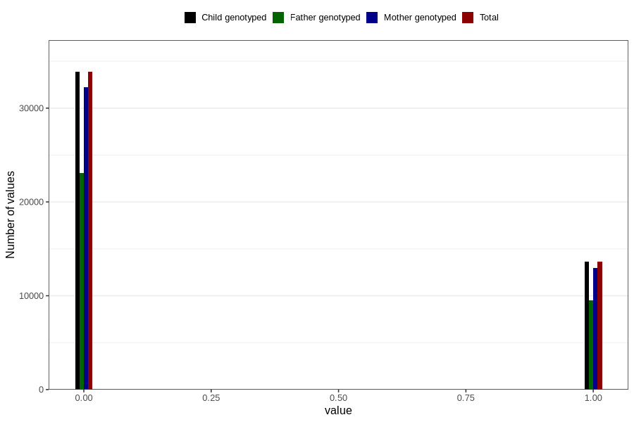

# birth_control_previous_6m
Variable mapping to `P_PILLEBRUK_6MND` in `Ultralyd`.
- Number of values:

| Value | Total | Child genotyped | Mother genotyped | Father genotyped |
| ----- | ----- | --------------- | ---------------- | ---------------- |
| Missing | 33306 | 33306 | 30820 | 20551 |
| Non-missing | 47500 | 47500 | 45204 | 32612 |
| 0 | 33857 | 33857 | 32219 | 23117 |
| 1 | 13643 | 13643 | 12985 | 9495 |

