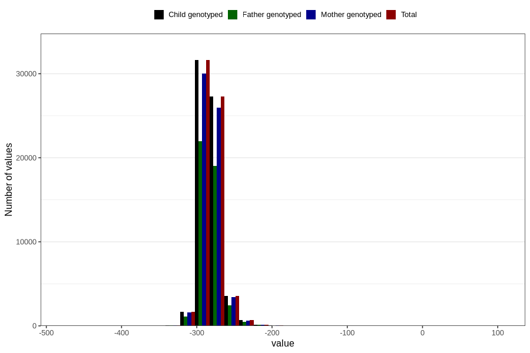

# child_age_at_last_menstruation
Variable mapping to `LMP_US_AGE` in `Ultralyd`.
- Number of values:

| Value | Total | Child genotyped | Mother genotyped | Father genotyped |
| ----- | ----- | --------------- | ---------------- | ---------------- |
| Missing | 15641 | 15641 | 14086 | 7921 |
| Non-missing | 65165 | 65165 | 61938 | 45242 |
| 25th percentile | -289 | -289 | -289 | -289 |
| 50th percentile | -283 | -283 | -283 | -283 |
| 75th percentile | -276 | -276 | -276 | -276 |
| Mean | -281.565763830277 | -281.565763830277 | -281.56018922148 | -281.559259095531 |
| Standard deviation | 13.378672604432 | 13.378672604432 | 13.3149074715595 | 13.1097875166614 |
| N | 65165 | 65165 | 61938 | 45242 |

