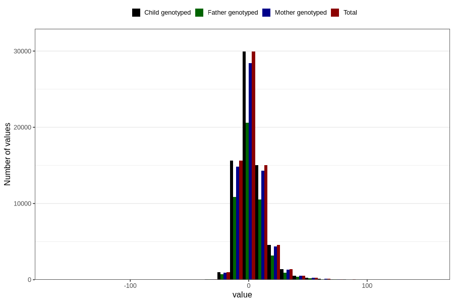

# child_age_at_ultrasound_appointment
Variable mapping to `US_DUE_DATE_AGE` in `Ultralyd`.
- Number of values:

| Value | Total | Child genotyped | Mother genotyped | Father genotyped |
| ----- | ----- | --------------- | ---------------- | ---------------- |
| Missing | 12204 | 12204 | 10844 | 5611 |
| Non-missing | 68602 | 68602 | 65180 | 47552 |
| 25th percentile | -5 | -5 | -5 | -5 |
| 50th percentile | 1 | 1 | 1 | 1 |
| 75th percentile | 8 | 8 | 8 | 8 |
| Mean | 2.33354712690592 | 2.33354712690592 | 2.33487266032525 | 2.31527590847914 |
| Standard deviation | 11.8135627782517 | 11.8135627782517 | 11.8142245736203 | 11.8295335606783 |
| N | 68602 | 68602 | 65180 | 47552 |

