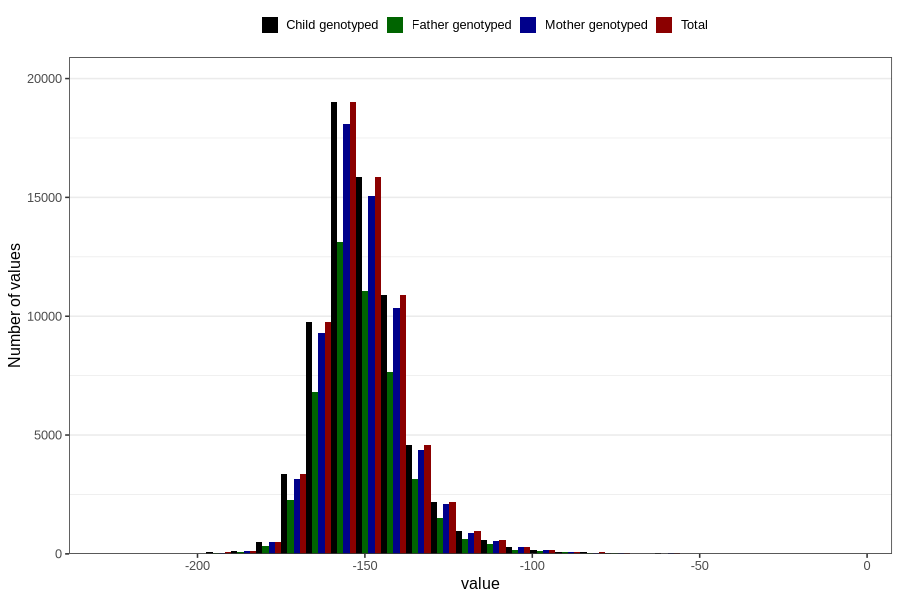

# child_age_at_ultrasound_screen
Variable mapping to `US_DATE_AGE` in `Ultralyd`.
- Number of values:

| Value | Total | Child genotyped | Mother genotyped | Father genotyped |
| ----- | ----- | --------------- | ---------------- | ---------------- |
| Missing | 12204 | 12204 | 10844 | 5611 |
| Non-missing | 68602 | 68602 | 65180 | 47552 |
| 25th percentile | -159 | -159 | -159 | -159 |
| 50th percentile | -152 | -152 | -152 | -152 |
| 75th percentile | -144 | -144 | -144 | -144 |
| Mean | -150.390819509635 | -150.390819509635 | -150.384826633937 | -150.373401749664 |
| Standard deviation | 13.3302791312481 | 13.3302791312481 | 13.3301747041025 | 13.2258922636012 |
| N | 68602 | 68602 | 65180 | 47552 |

