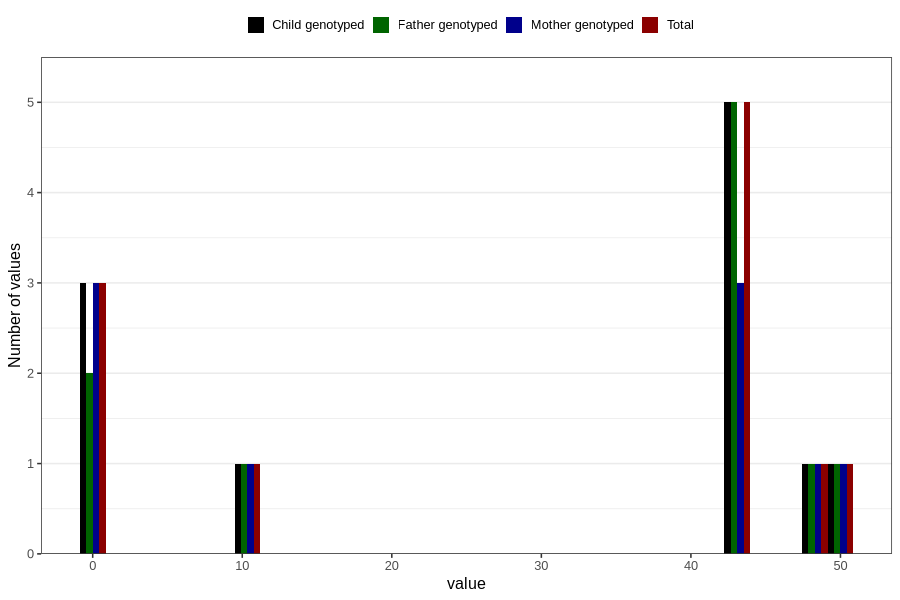

# crown_rump_length_fetus2
Variable mapping to `CRL_F2` in `Ultralyd`.
- Number of values:

| Value | Total | Child genotyped | Mother genotyped | Father genotyped |
| ----- | ----- | --------------- | ---------------- | ---------------- |
| Missing | 80795 | 80795 | 76015 | 53153 |
| Non-missing | 11 | 11 | 9 | 10 |
| 0 | 3 | 3 | 3 | 2 |
| 11 | 1 | 1 | 1 | 1 |
| 43 | 5 | 5 | 3 | 5 |
| 48 | 1 | 1 | 1 | 1 |
| 50 | 1 | 1 | 1 | 1 |

