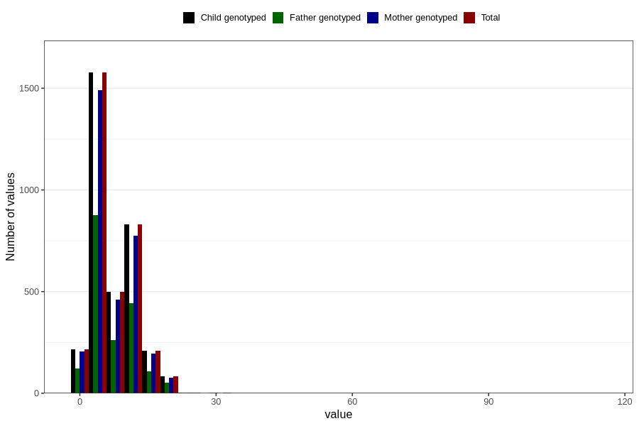

# cugarettes_per_day
Variable mapping to `ROKER_ANT` in `Ultralyd`.
- Number of values:

| Value | Total | Child genotyped | Mother genotyped | Father genotyped |
| ----- | ----- | --------------- | ---------------- | ---------------- |
| Missing | 77380 | 77380 | 72808 | 51294 |
| Non-missing | 3426 | 3426 | 3216 | 1869 |
| 25th percentile | 4 | 4 | 4 | 3 |
| 50th percentile | 5 | 5 | 5 | 5 |
| 75th percentile | 10 | 10 | 10 | 10 |
| Mean | 6.87419731465266 | 6.87419731465266 | 6.84483830845771 | 6.79240235420011 |
| Standard deviation | 4.78430460186131 | 4.78430460186131 | 4.80712192992022 | 4.4401475341437 |
| N | 3426 | 3426 | 3216 | 1869 |

