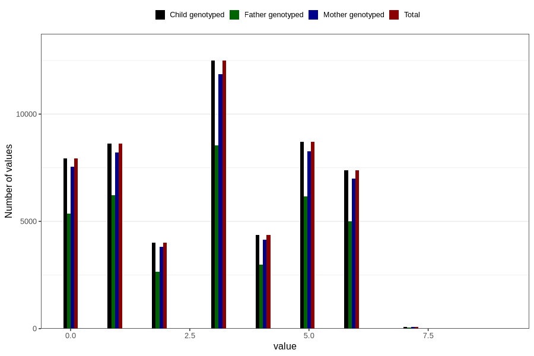

# duration_days
Variable mapping to `VARIGHET_DAGER` in `Ultralyd`.
- Number of values:

| Value | Total | Child genotyped | Mother genotyped | Father genotyped |
| ----- | ----- | --------------- | ---------------- | ---------------- |
| Missing | 27188 | 27188 | 25081 | 16122 |
| Non-missing | 53618 | 53618 | 50943 | 37041 |
| 0 | 7929 | 7929 | 7549 | 5375 |
| 1 | 8640 | 8640 | 8215 | 6223 |
| 2 | 4011 | 4011 | 3803 | 2665 |
| 3 | 12491 | 12491 | 11876 | 8544 |
| 4 | 4357 | 4357 | 4133 | 2991 |
| 5 | 8718 | 8718 | 8266 | 6166 |
| 6 | 7373 | 7373 | 7005 | 5013 |
| 7 | 88 | 88 | 86 | 58 |
| 8 | 4 | 4 | 3 | 1 |
| 9 | 7 | 7 | 7 | 5 |

