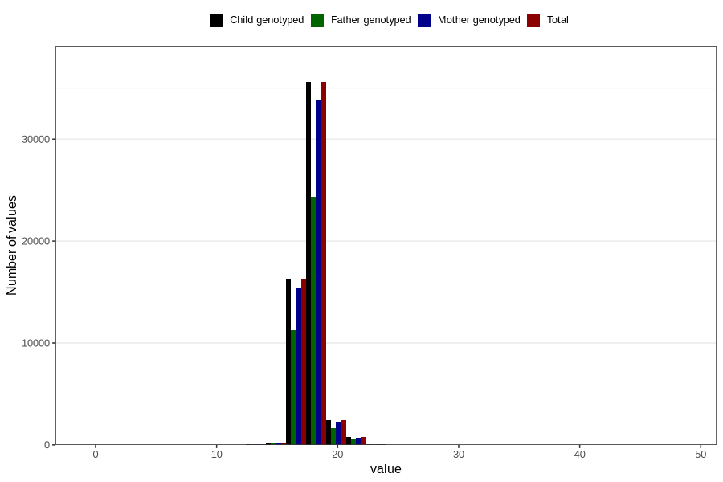

# duration_weeks
Variable mapping to `VARIGHET_UKER` in `Ultralyd`.
- Number of values:

| Value | Total | Child genotyped | Mother genotyped | Father genotyped |
| ----- | ----- | --------------- | ---------------- | ---------------- |
| Missing | 25373 | 25373 | 23361 | 15165 |
| Non-missing | 55433 | 55433 | 52663 | 37998 |
| 25th percentile | 17 | 17 | 17 | 17 |
| 50th percentile | 18 | 18 | 18 | 18 |
| 75th percentile | 19 | 19 | 19 | 19 |
| Mean | 18.0099579672758 | 18.0099579672758 | 18.0101209577882 | 18.0027896205063 |
| Standard deviation | 1.13020259317095 | 1.13020259317095 | 1.12811210476627 | 1.10736033978619 |
| N | 55433 | 55433 | 52663 | 37998 |

