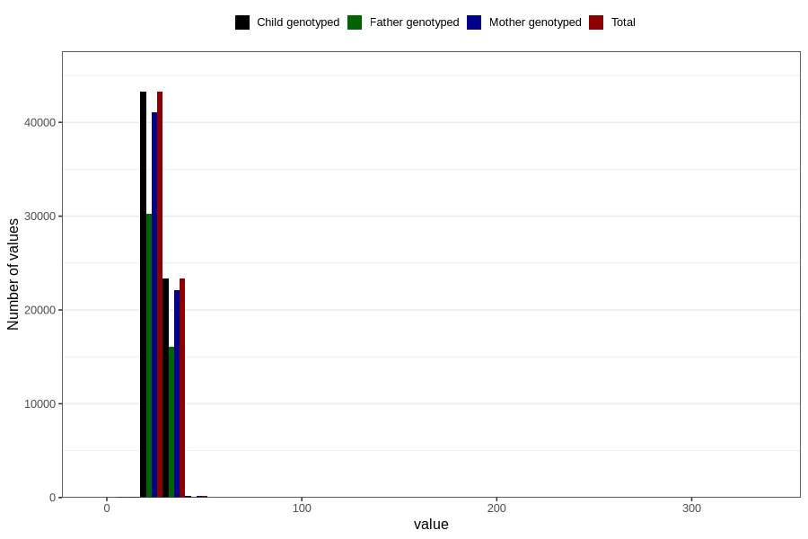

# femur_length
Variable mapping to `FEMUR` in `Ultralyd`.
- Number of values:

| Value | Total | Child genotyped | Mother genotyped | Father genotyped |
| ----- | ----- | --------------- | ---------------- | ---------------- |
| Missing | 13982 | 13982 | 12529 | 6638 |
| Non-missing | 66824 | 66824 | 63495 | 46525 |
| 25th percentile | 26 | 26 | 26 | 26 |
| 50th percentile | 28 | 28 | 28 | 27 |
| 75th percentile | 29 | 29 | 29 | 29 |
| Mean | 27.6608404166168 | 27.6608404166168 | 27.6606189463737 | 27.6233207952714 |
| Standard deviation | 3.34523949621622 | 3.34523949621622 | 3.35979800464067 | 2.9910151792408 |
| N | 66824 | 66824 | 63495 | 46525 |

