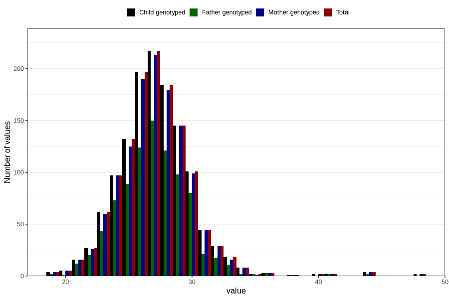

# femur_length_fetus2
Variable mapping to `FEMUR_F2` in `Ultralyd`.
- Number of values:

| Value | Total | Child genotyped | Mother genotyped | Father genotyped |
| ----- | ----- | --------------- | ---------------- | ---------------- |
| Missing | 79504 | 79504 | 74753 | 52289 |
| Non-missing | 1302 | 1302 | 1271 | 874 |
| 25th percentile | 25 | 25 | 25 | 25 |
| 50th percentile | 27 | 27 | 27 | 27 |
| 75th percentile | 29 | 29 | 29 | 29 |
| Mean | 27.1397849462366 | 27.1397849462366 | 27.1455546813533 | 27.0389016018307 |
| Standard deviation | 3.00122433891602 | 3.00122433891602 | 3.00473017955504 | 2.80783500132389 |
| N | 1302 | 1302 | 1271 | 874 |

