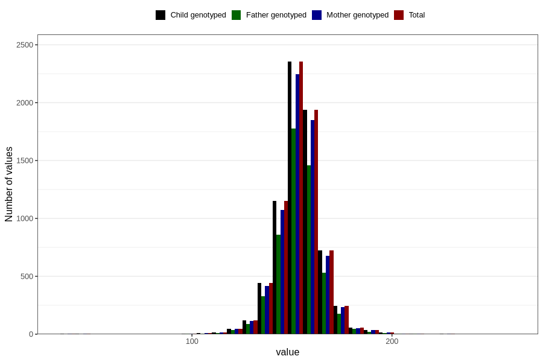

# head_circumference
Variable mapping to `HO` in `Ultralyd`.
- Number of values:

| Value | Total | Child genotyped | Mother genotyped | Father genotyped |
| ----- | ----- | --------------- | ---------------- | ---------------- |
| Missing | 73636 | 73636 | 69220 | 47805 |
| Non-missing | 7170 | 7170 | 6804 | 5358 |
| 25th percentile | 148 | 148 | 148 | 148 |
| 50th percentile | 154 | 154 | 154 | 154 |
| 75th percentile | 160 | 160 | 160 | 160 |
| Mean | 153.729567642957 | 153.729567642957 | 153.750293944738 | 153.70156774916 |
| Standard deviation | 11.4060759104377 | 11.4060759104377 | 11.3574138578617 | 11.1211681978689 |
| N | 7170 | 7170 | 6804 | 5358 |

