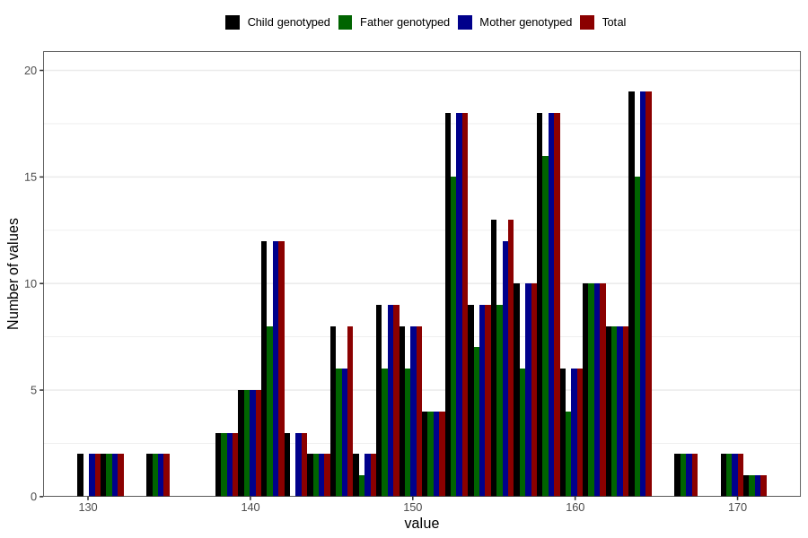

# head_circumference_fetus2
Variable mapping to `HO_F2` in `Ultralyd`.
- Number of values:

| Value | Total | Child genotyped | Mother genotyped | Father genotyped |
| ----- | ----- | --------------- | ---------------- | ---------------- |
| Missing | 80628 | 80628 | 75849 | 53023 |
| Non-missing | 178 | 178 | 175 | 140 |
| 25th percentile | 148 | 148 | 148 | 149.75 |
| 50th percentile | 154.5 | 154.5 | 155 | 155 |
| 75th percentile | 160 | 160 | 160 | 161 |
| Mean | 153.421348314607 | 153.421348314607 | 153.502857142857 | 154.05 |
| Standard deviation | 8.57647514165305 | 8.57647514165305 | 8.60023675543816 | 8.49233679105238 |
| N | 178 | 178 | 175 | 140 |

