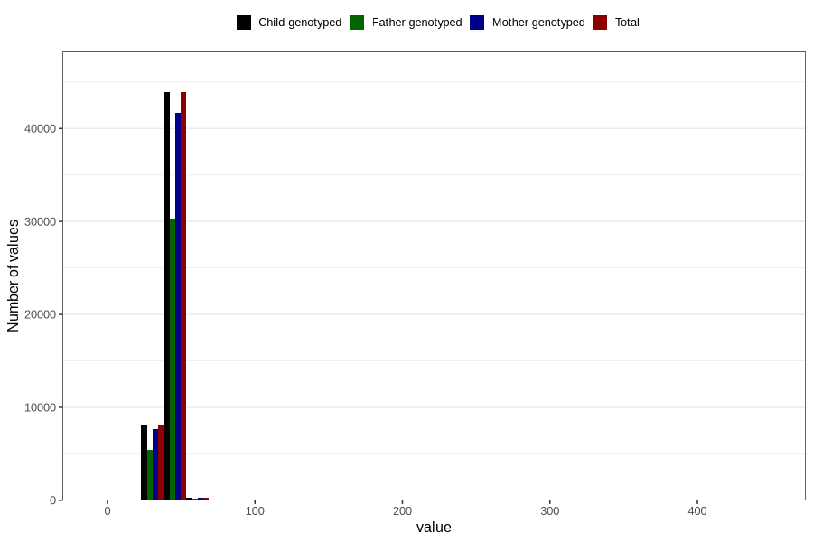

# mean_abdominal_diameter
Variable mapping to `MAD` in `Ultralyd`.
- Number of values:

| Value | Total | Child genotyped | Mother genotyped | Father genotyped |
| ----- | ----- | --------------- | ---------------- | ---------------- |
| Missing | 28462 | 28462 | 26358 | 17125 |
| Non-missing | 52344 | 52344 | 49666 | 36038 |
| 25th percentile | 40 | 40 | 40 | 40 |
| 50th percentile | 42 | 42 | 42 | 42 |
| 75th percentile | 44 | 44 | 44 | 44 |
| Mean | 41.7632775485251 | 41.7632775485251 | 41.765674707043 | 41.7809811865253 |
| Standard deviation | 4.83995577329282 | 4.83995577329282 | 4.89077502067314 | 4.76754448132583 |
| N | 52344 | 52344 | 49666 | 36038 |

