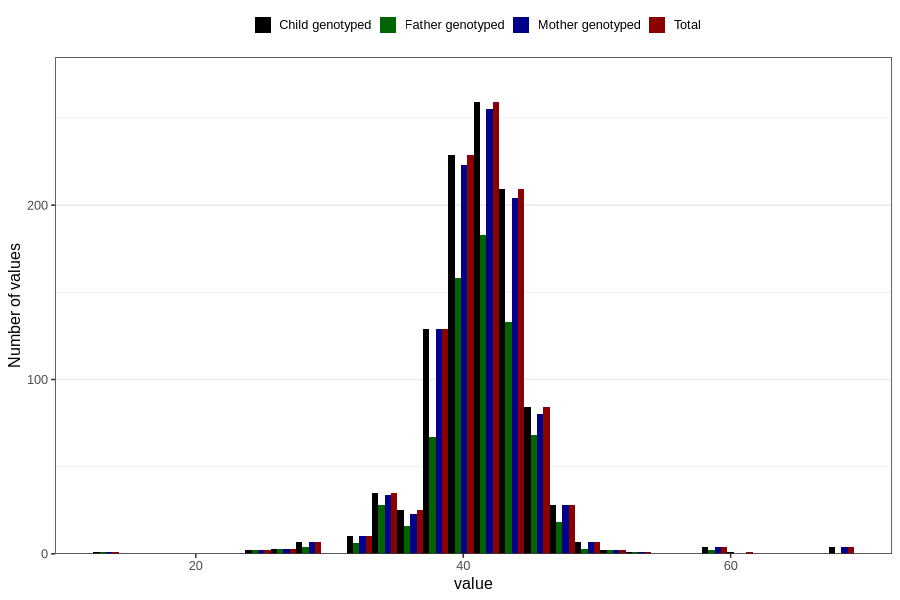

# mean_abdominal_diameter_fetus2
Variable mapping to `MAD_F2` in `Ultralyd`.
- Number of values:

| Value | Total | Child genotyped | Mother genotyped | Father genotyped |
| ----- | ----- | --------------- | ---------------- | ---------------- |
| Missing | 79766 | 79766 | 75007 | 52468 |
| Non-missing | 1040 | 1040 | 1017 | 695 |
| 25th percentile | 39 | 39 | 39 | 39 |
| 50th percentile | 41 | 41 | 41 | 41 |
| 75th percentile | 43 | 43 | 43 | 43 |
| Mean | 41.075 | 41.075 | 41.055063913471 | 41.0230215827338 |
| Standard deviation | 4.07794013751536 | 4.07794013751536 | 4.05631087252113 | 3.74851203037907 |
| N | 1040 | 1040 | 1017 | 695 |

