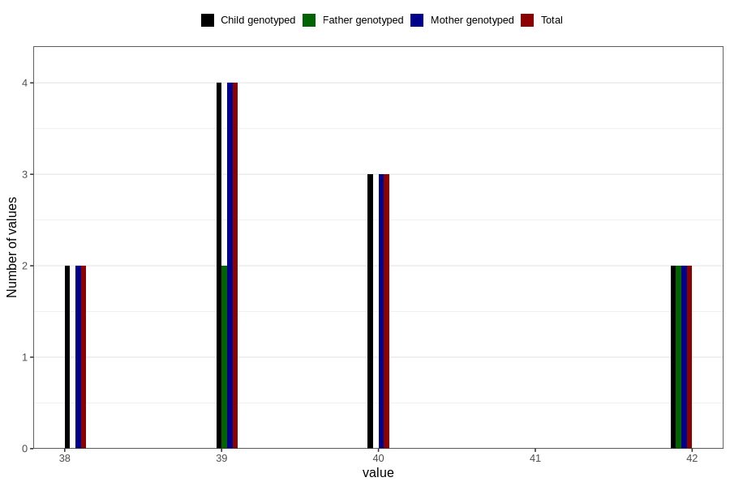

# mean_abdominal_diameter_fetus3
Variable mapping to `MAD_F3` in `Ultralyd`.
- Number of values:

| Value | Total | Child genotyped | Mother genotyped | Father genotyped |
| ----- | ----- | --------------- | ---------------- | ---------------- |
| Missing | 80795 | 80795 | 76013 | 53159 |
| Non-missing | 11 | 11 | 11 | 4 |
| 38 | 2 | 2 | 2 | 0 |
| 39 | 4 | 4 | 4 | 2 |
| 40 | 3 | 3 | 3 | 0 |
| 42 | 2 | 2 | 2 | 2 |

