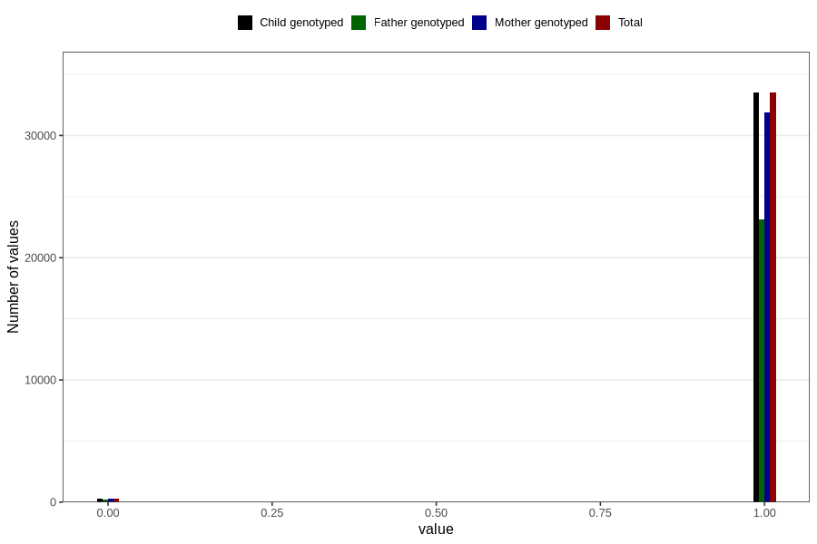

# placenta_anterior
Variable mapping to `PL_ANTERIOR` in `Ultralyd`.
- Number of values:

| Value | Total | Child genotyped | Mother genotyped | Father genotyped |
| ----- | ----- | --------------- | ---------------- | ---------------- |
| Missing | 47021 | 47021 | 43889 | 29794 |
| Non-missing | 33785 | 33785 | 32135 | 23369 |
| 0 | 285 | 285 | 273 | 211 |
| 1 | 33500 | 33500 | 31862 | 23158 |

