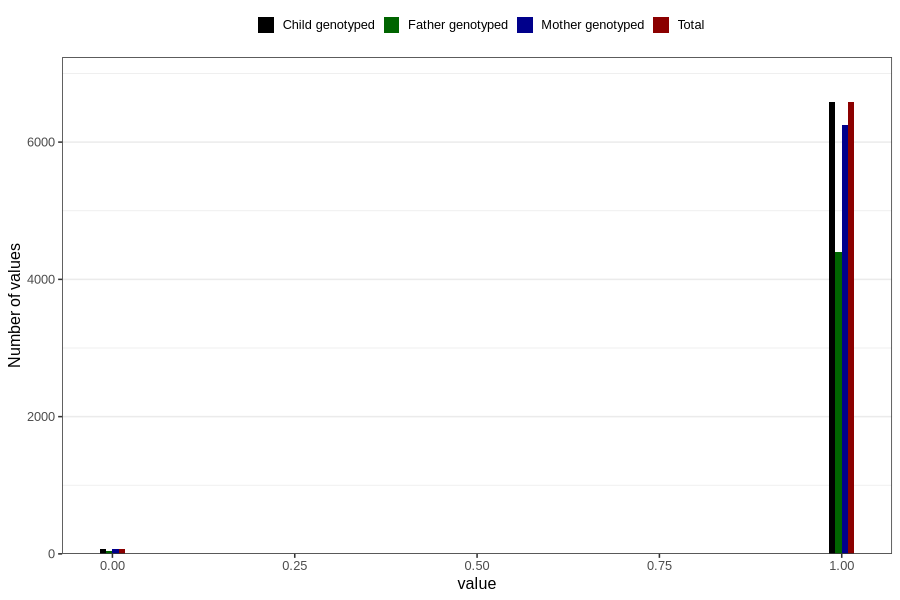

# placenta_fundal
Variable mapping to `PL_FUNDUS` in `Ultralyd`.
- Number of values:

| Value | Total | Child genotyped | Mother genotyped | Father genotyped |
| ----- | ----- | --------------- | ---------------- | ---------------- |
| Missing | 74153 | 74153 | 69705 | 48729 |
| Non-missing | 6653 | 6653 | 6319 | 4434 |
| 0 | 73 | 73 | 70 | 39 |
| 1 | 6580 | 6580 | 6249 | 4395 |

