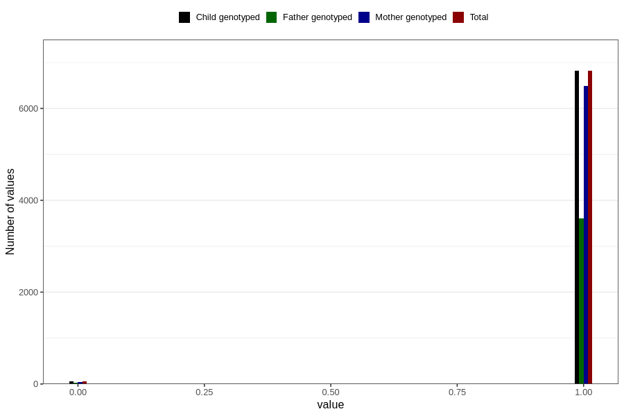

# placenta_latdext
Variable mapping to `PL_LATDEXT` in `Ultralyd`.
- Number of values:

| Value | Total | Child genotyped | Mother genotyped | Father genotyped |
| ----- | ----- | --------------- | ---------------- | ---------------- |
| Missing | 73934 | 73934 | 69480 | 49527 |
| Non-missing | 6872 | 6872 | 6544 | 3636 |
| 0 | 55 | 55 | 50 | 32 |
| 1 | 6817 | 6817 | 6494 | 3604 |

