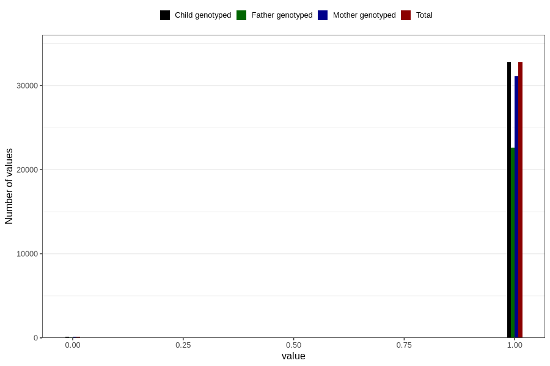

# placenta_posterior
Variable mapping to `PL_POSTERIOR` in `Ultralyd`.
- Number of values:

| Value | Total | Child genotyped | Mother genotyped | Father genotyped |
| ----- | ----- | --------------- | ---------------- | ---------------- |
| Missing | 47929 | 47929 | 44800 | 30458 |
| Non-missing | 32877 | 32877 | 31224 | 22705 |
| 0 | 114 | 114 | 107 | 79 |
| 1 | 32763 | 32763 | 31117 | 22626 |

