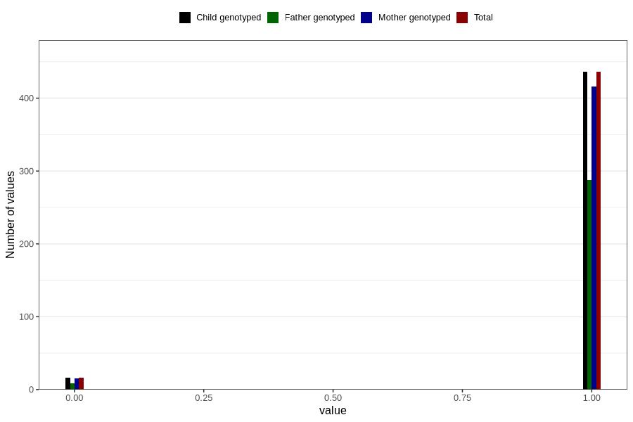

# placenta_previa_central
Variable mapping to `PL_PREVIACENTR` in `Ultralyd`.
- Number of values:

| Value | Total | Child genotyped | Mother genotyped | Father genotyped |
| ----- | ----- | --------------- | ---------------- | ---------------- |
| Missing | 80354 | 80354 | 75593 | 52866 |
| Non-missing | 452 | 452 | 431 | 297 |
| 0 | 16 | 16 | 15 | 9 |
| 1 | 436 | 436 | 416 | 288 |

