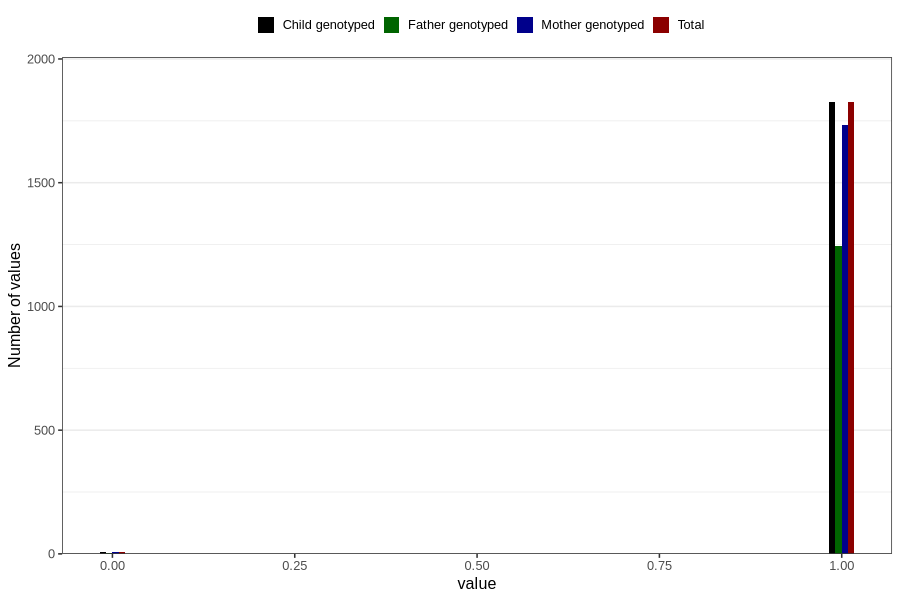

# placenta_previa_marginal
Variable mapping to `PL_PREVIAMARG` in `Ultralyd`.
- Number of values:

| Value | Total | Child genotyped | Mother genotyped | Father genotyped |
| ----- | ----- | --------------- | ---------------- | ---------------- |
| Missing | 78975 | 78975 | 74285 | 51913 |
| Non-missing | 1831 | 1831 | 1739 | 1250 |
| 0 | 6 | 6 | 6 | 4 |
| 1 | 1825 | 1825 | 1733 | 1246 |

