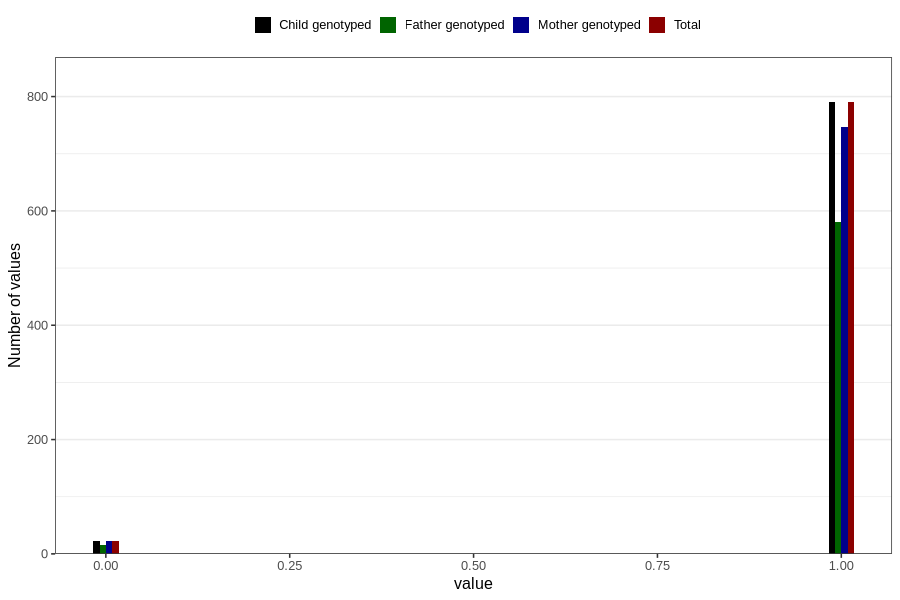

# placenta_previa_partial
Variable mapping to `PL_PREVIAPART` in `Ultralyd`.
- Number of values:

| Value | Total | Child genotyped | Mother genotyped | Father genotyped |
| ----- | ----- | --------------- | ---------------- | ---------------- |
| Missing | 79993 | 79993 | 75255 | 52566 |
| Non-missing | 813 | 813 | 769 | 597 |
| 0 | 23 | 23 | 22 | 16 |
| 1 | 790 | 790 | 747 | 581 |

