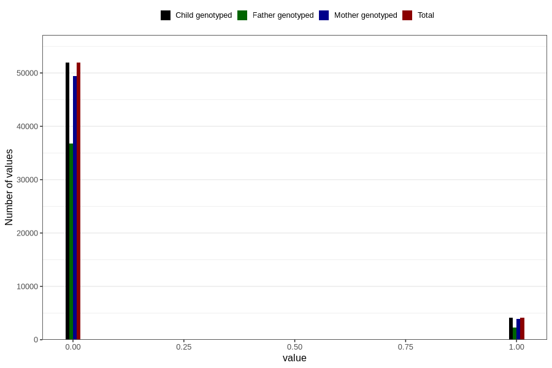

# smoker
Variable mapping to `ROKER` in `Ultralyd`.
- Number of values:

| Value | Total | Child genotyped | Mother genotyped | Father genotyped |
| ----- | ----- | --------------- | ---------------- | ---------------- |
| Missing | 24771 | 24771 | 22753 | 14059 |
| Non-missing | 56035 | 56035 | 53271 | 39104 |
| 0 | 51913 | 51913 | 49392 | 36792 |
| 1 | 4122 | 4122 | 3879 | 2312 |

