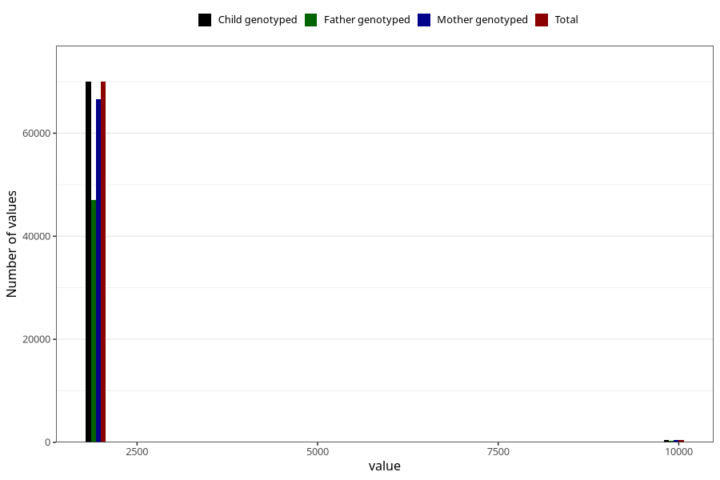

# q1_year_filled
Variable mapping to `AA11` in `Skjema1_v12`.
- Number of values:

| Value | Total | Child genotyped | Mother genotyped | Father genotyped |
| ----- | ----- | --------------- | ---------------- | ---------------- |
| Missing | 4932 | 4932 | 4675 | 2852 |
| Non-missing | 70376 | 70376 | 66975 | 47232 |
| 1999 | 540 | 540 | 524 | 92 |
| 2000 | 1831 | 1831 | 1784 | 481 |
| 2001 | 4076 | 4076 | 3985 | 1701 |
| 2002 | 7134 | 7134 | 6838 | 4488 |
| 2003 | 8943 | 8943 | 8542 | 5995 |
| 2004 | 9558 | 9558 | 9104 | 6763 |
| 2005 | 11415 | 11415 | 10813 | 8275 |
| 2006 | 10252 | 10252 | 9670 | 7470 |
| 2007 | 9897 | 9897 | 9329 | 7041 |
| 2008 | 6282 | 6282 | 5957 | 4627 |
| 2009 | 58 | 58 | 56 | 44 |
| 2044 | 1 | 1 | 1 | 0 |
| 9999 | 389 | 389 | 372 | 255 |

