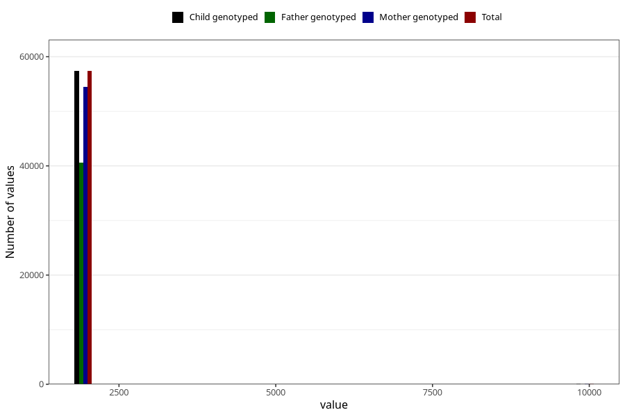

# q2_year_filled
Variable mapping to `BB11` in `Skjema2CDW_v12`.
- Number of values:

| Value | Total | Child genotyped | Mother genotyped | Father genotyped |
| ----- | ----- | --------------- | ---------------- | ---------------- |
| Missing | 17876 | 17876 | 17121 | 9439 |
| Non-missing | 57432 | 57432 | 54529 | 40645 |
| 2000 | 2 | 2 | 2 | 1 |
| 2001 | 50 | 50 | 46 | 32 |
| 2002 | 5591 | 5591 | 5349 | 3607 |
| 2003 | 8238 | 8238 | 7873 | 5518 |
| 2004 | 8106 | 8106 | 7731 | 5743 |
| 2005 | 10068 | 10068 | 9540 | 7314 |
| 2006 | 9684 | 9684 | 9185 | 7105 |
| 2007 | 8806 | 8806 | 8281 | 6239 |
| 2008 | 6358 | 6358 | 6022 | 4703 |
| 2009 | 471 | 471 | 445 | 340 |
| 9999 | 58 | 58 | 55 | 43 |

