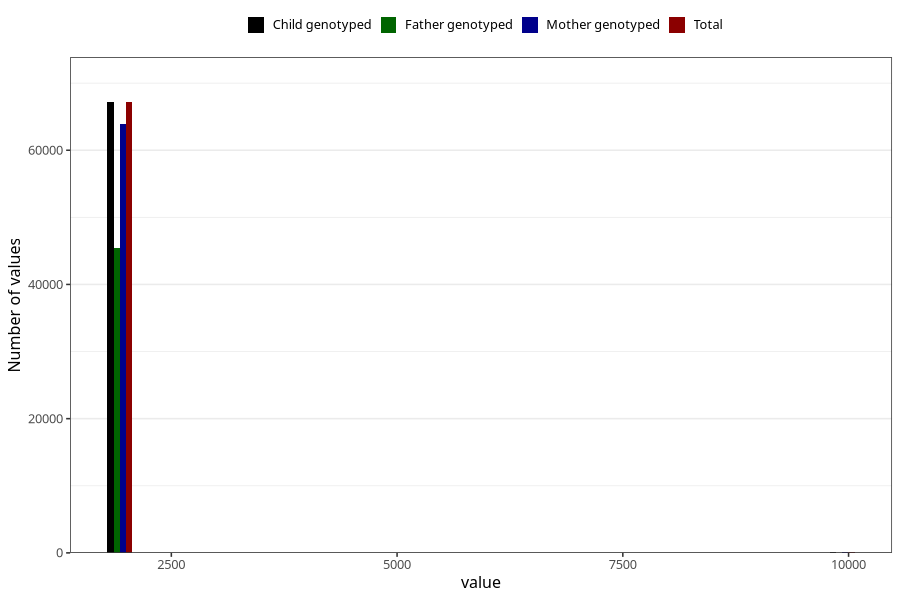

# q3_year_filled
Variable mapping to `CC11` in `Skjema3_v12`.
- Number of values:

| Value | Total | Child genotyped | Mother genotyped | Father genotyped |
| ----- | ----- | --------------- | ---------------- | ---------------- |
| Missing | 8063 | 8063 | 7600 | 4628 |
| Non-missing | 67245 | 67245 | 64050 | 45456 |
| 2000 | 1125 | 1125 | 1097 | 235 |
| 2001 | 3326 | 3326 | 3259 | 1257 |
| 2002 | 6252 | 6252 | 6020 | 3728 |
| 2003 | 8530 | 8530 | 8170 | 5616 |
| 2004 | 9437 | 9437 | 9011 | 6687 |
| 2005 | 10289 | 10289 | 9753 | 7438 |
| 2006 | 10195 | 10195 | 9657 | 7512 |
| 2007 | 9479 | 9479 | 8896 | 6689 |
| 2008 | 7379 | 7379 | 7031 | 5394 |
| 2009 | 1148 | 1148 | 1076 | 847 |
| 9999 | 85 | 85 | 80 | 53 |

