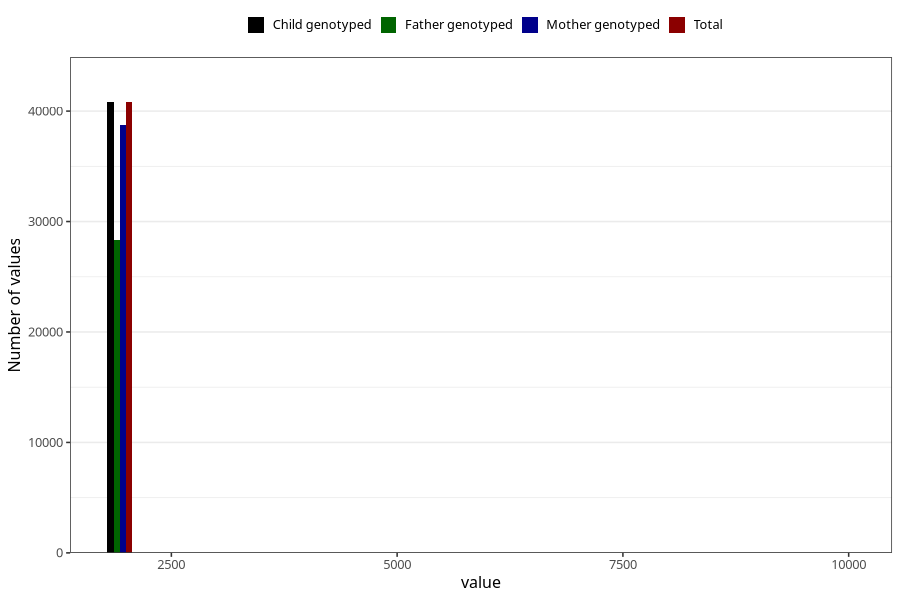

# q3y_year_filled
Variable mapping to `GG11` in `Skjema6_3aar_v12`.
- Number of values:

| Value | Total | Child genotyped | Mother genotyped | Father genotyped |
| ----- | ----- | --------------- | ---------------- | ---------------- |
| Missing | 34494 | 34494 | 32867 | 21730 |
| Non-missing | 40814 | 40814 | 38783 | 28354 |
| 2001 | 5 | 5 | 3 | 2 |
| 2002 | 15 | 15 | 14 | 9 |
| 2003 | 15 | 15 | 15 | 11 |
| 2004 | 780 | 780 | 760 | 304 |
| 2005 | 3567 | 3567 | 3442 | 1994 |
| 2006 | 5648 | 5648 | 5409 | 3769 |
| 2007 | 5850 | 5850 | 5577 | 4096 |
| 2008 | 6176 | 6176 | 5835 | 4421 |
| 2009 | 6706 | 6706 | 6352 | 4991 |
| 2010 | 5707 | 5707 | 5339 | 4079 |
| 2011 | 4972 | 4972 | 4744 | 3672 |
| 2012 | 1359 | 1359 | 1279 | 998 |
| 2013 | 5 | 5 | 5 | 2 |
| 2014 | 1 | 1 | 1 | 1 |
| 9999 | 8 | 8 | 8 | 5 |

