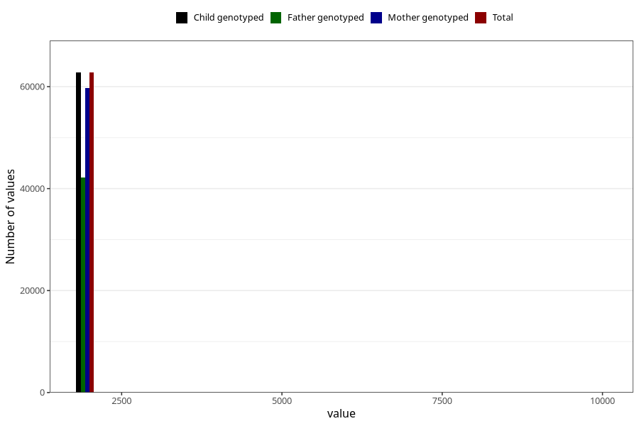

# q4_year_filled
Variable mapping to `DD11` in `Skjema4_6mnd_v12`.
- Number of values:

| Value | Total | Child genotyped | Mother genotyped | Father genotyped |
| ----- | ----- | --------------- | ---------------- | ---------------- |
| Missing | 12507 | 12507 | 11851 | 7823 |
| Non-missing | 62801 | 62801 | 59799 | 42261 |
| 2000 | 610 | 610 | 594 | 114 |
| 2001 | 1702 | 1702 | 1660 | 461 |
| 2002 | 3852 | 3852 | 3753 | 1662 |
| 2003 | 6684 | 6684 | 6413 | 4269 |
| 2004 | 8377 | 8377 | 8004 | 5654 |
| 2005 | 8526 | 8526 | 8111 | 6056 |
| 2006 | 10153 | 10153 | 9623 | 7444 |
| 2007 | 8975 | 8975 | 8479 | 6521 |
| 2008 | 8604 | 8604 | 8113 | 6141 |
| 2009 | 5259 | 5259 | 4994 | 3903 |
| 2010 | 19 | 19 | 18 | 14 |
| 2022 | 1 | 1 | 1 | 1 |
| 2033 | 1 | 1 | 1 | 0 |
| 2066 | 1 | 1 | 1 | 1 |
| 9999 | 37 | 37 | 34 | 20 |

