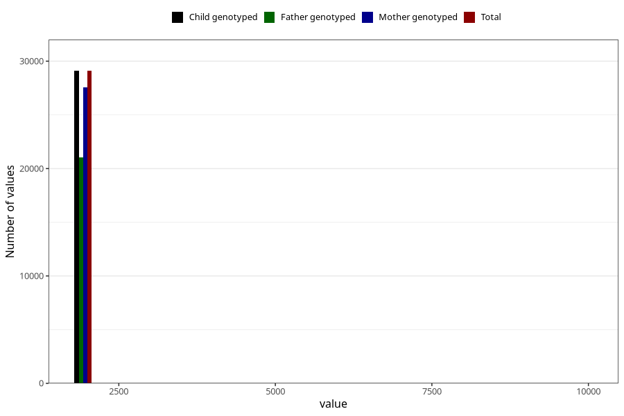

# q5y_year_filled
Variable mapping to `LL11` in `Skjema5aar_v12`.
- Number of values:

| Value | Total | Child genotyped | Mother genotyped | Father genotyped |
| ----- | ----- | --------------- | ---------------- | ---------------- |
| Missing | 46203 | 46203 | 44084 | 29038 |
| Non-missing | 29105 | 29105 | 27566 | 21046 |
| 2001 | 4 | 4 | 3 | 3 |
| 2003 | 1 | 1 | 1 | 1 |
| 2004 | 16 | 16 | 15 | 14 |
| 2005 | 17 | 17 | 17 | 15 |
| 2006 | 14 | 14 | 13 | 9 |
| 2007 | 16 | 16 | 16 | 10 |
| 2008 | 9 | 9 | 9 | 7 |
| 2009 | 14 | 14 | 14 | 11 |
| 2010 | 10770 | 10770 | 10235 | 7631 |
| 2011 | 6430 | 6430 | 6114 | 4756 |
| 2012 | 4934 | 4934 | 4599 | 3517 |
| 2013 | 5182 | 5182 | 4919 | 3790 |
| 2014 | 1686 | 1686 | 1599 | 1274 |
| 2015 | 4 | 4 | 4 | 1 |
| 2016 | 1 | 1 | 1 | 1 |
| 2017 | 1 | 1 | 1 | 1 |
| 2021 | 1 | 1 | 1 | 1 |
| 9999 | 5 | 5 | 5 | 4 |

