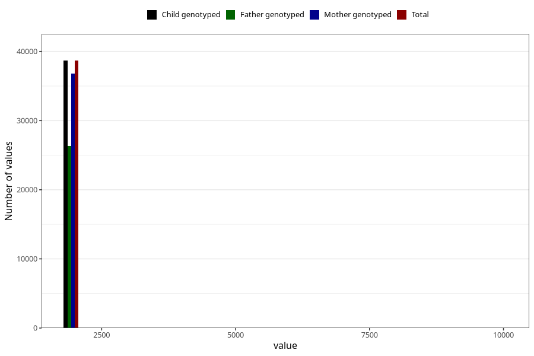

# q7y_year_filled
Variable mapping to `JJ11` in `Skjema7aar_v12`.
- Number of values:

| Value | Total | Child genotyped | Mother genotyped | Father genotyped |
| ----- | ----- | --------------- | ---------------- | ---------------- |
| Missing | 36627 | 36627 | 34882 | 23786 |
| Non-missing | 38681 | 38681 | 36768 | 26298 |
| 25th percentile | 2011 | 2011 | 2010 | 2011 |
| 50th percentile | 2012 | 2012 | 2012 | 2013 |
| 75th percentile | 2014 | 2014 | 2014 | 2014 |
| Mean | 2013.64646725783 | 2013.64646725783 | 2013.70409051349 | 2013.94965396608 |
| Standard deviation | 107.457257855223 | 107.457257855223 | 110.216027054139 | 110.137416775136 |
| N | 38681 | 38681 | 36768 | 26298 |

