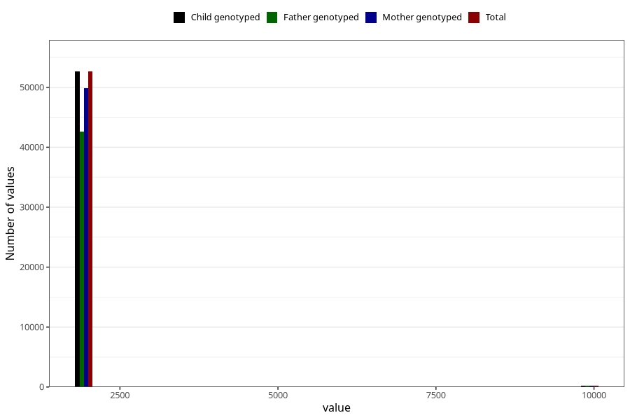

# qFar_year_filled
Variable mapping to `FF11` in `SkjemaFar_v12`.
- Number of values:

| Value | Total | Child genotyped | Mother genotyped | Father genotyped |
| ----- | ----- | --------------- | ---------------- | ---------------- |
| Missing | 22425 | 22425 | 21514 | 7249 |
| Non-missing | 52883 | 52883 | 50136 | 42835 |
| 2000 | 3 | 3 | 3 | 2 |
| 2001 | 903 | 903 | 869 | 732 |
| 2002 | 4984 | 4984 | 4759 | 4007 |
| 2003 | 7100 | 7100 | 6764 | 5630 |
| 2004 | 7916 | 7916 | 7521 | 6399 |
| 2005 | 9652 | 9652 | 9140 | 7829 |
| 2006 | 8599 | 8599 | 8114 | 7080 |
| 2007 | 8124 | 8124 | 7653 | 6535 |
| 2008 | 5273 | 5273 | 5002 | 4357 |
| 2009 | 77 | 77 | 74 | 63 |
| 9999 | 252 | 252 | 237 | 201 |

