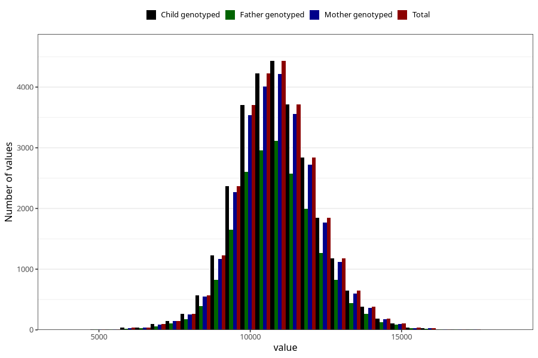

# weight_15_18m_2
Variable mapping to `GG16` in `Skjema6_3aar_v12`.
- Number of values:

| Value | Total | Child genotyped | Mother genotyped | Father genotyped |
| ----- | ----- | --------------- | ---------------- | ---------------- |
| Missing | 47195 | 47195 | 44855 | 30485 |
| Non-missing | 28113 | 28113 | 26795 | 19599 |
| 25th percentile | 10000 | 10000 | 10000 | 10000 |
| 50th percentile | 10810 | 10810 | 10810 | 10800 |
| 75th percentile | 11700 | 11700 | 11700 | 11700 |
| Mean | 10869.68722655 | 10869.68722655 | 10868.7660757604 | 10873.2329200469 |
| Standard deviation | 1358.96204298072 | 1358.96204298072 | 1358.30489569186 | 1358.41280485301 |
| N | 28113 | 28113 | 26795 | 19599 |

