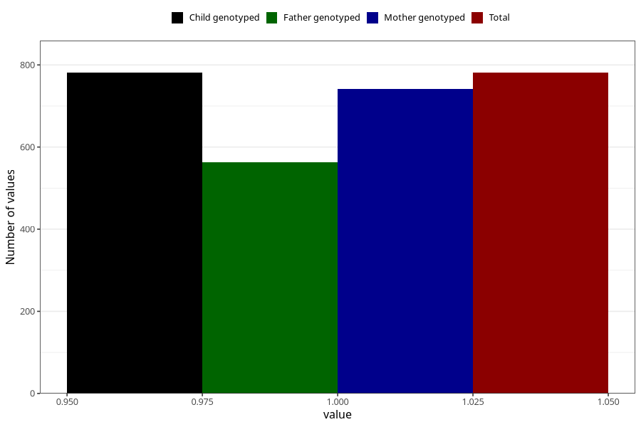

# asthma_previously_18m
Variable mapping to `EE825` in `Skjema5_18mnd_v12`.
- Number of values:

| Value | Total | Child genotyped | Mother genotyped | Father genotyped |
| ----- | ----- | --------------- | ---------------- | ---------------- |
| Missing | 74527 | 74527 | 70908 | 49521 |
| Non-missing | 781 | 781 | 742 | 563 |
| 1 | 781 | 781 | 742 | 563 |

