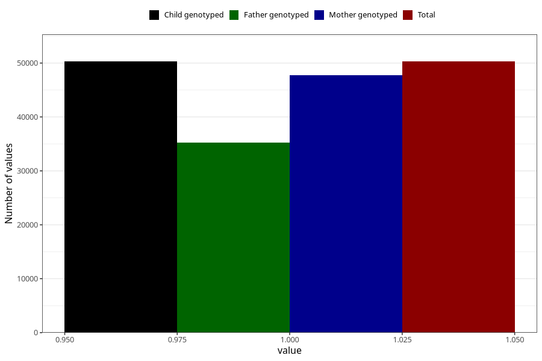

# behavioural_problems_no_18m
Variable mapping to `EE847` in `Skjema5_18mnd_v12`.
- Number of values:

| Value | Total | Child genotyped | Mother genotyped | Father genotyped |
| ----- | ----- | --------------- | ---------------- | ---------------- |
| Missing | 25022 | 25022 | 23875 | 14860 |
| Non-missing | 50286 | 50286 | 47775 | 35224 |
| 1 | 50286 | 50286 | 47775 | 35224 |

