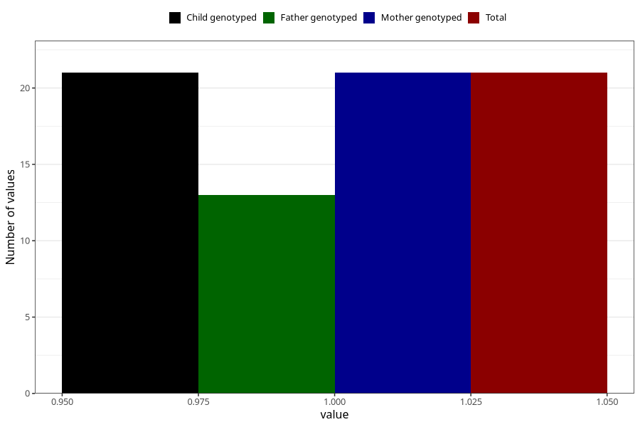

# behavioural_problems_previously_18m
Variable mapping to `EE849` in `Skjema5_18mnd_v12`.
- Number of values:

| Value | Total | Child genotyped | Mother genotyped | Father genotyped |
| ----- | ----- | --------------- | ---------------- | ---------------- |
| Missing | 75287 | 75287 | 71629 | 50071 |
| Non-missing | 21 | 21 | 21 | 13 |
| 1 | 21 | 21 | 21 | 13 |

