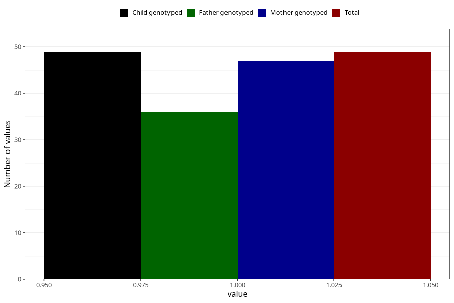

# cerebral_palsy_yes_3y
Variable mapping to `GG42` in `Skjema6_3aar_v12`.
- Number of values:

| Value | Total | Child genotyped | Mother genotyped | Father genotyped |
| ----- | ----- | --------------- | ---------------- | ---------------- |
| Missing | 75259 | 75259 | 71603 | 50048 |
| Non-missing | 49 | 49 | 47 | 36 |
| 1 | 49 | 49 | 47 | 36 |

