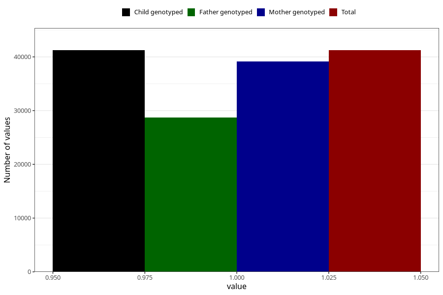

# diabetes_no_3y
Variable mapping to `GG49` in `Skjema6_3aar_v12`.
- Number of values:

| Value | Total | Child genotyped | Mother genotyped | Father genotyped |
| ----- | ----- | --------------- | ---------------- | ---------------- |
| Missing | 34076 | 34076 | 32472 | 21349 |
| Non-missing | 41232 | 41232 | 39178 | 28735 |
| 1 | 41232 | 41232 | 39178 | 28735 |

