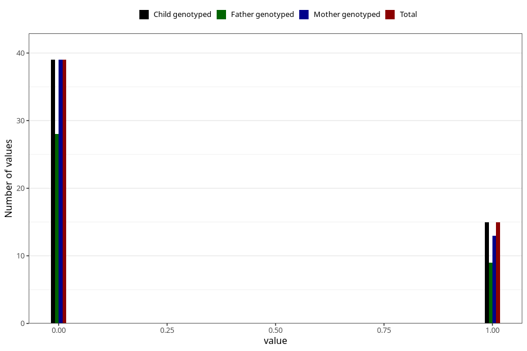

# encephalitis_meningitis_freq_3y
Variable mapping to `GG156` in `Skjema6_3aar_v12`.
- Number of values:

| Value | Total | Child genotyped | Mother genotyped | Father genotyped |
| ----- | ----- | --------------- | ---------------- | ---------------- |
| Missing | 75254 | 75254 | 71598 | 50047 |
| Non-missing | 54 | 54 | 52 | 37 |
| 0 | 39 | 39 | 39 | 28 |
| 1 | 15 | 15 | 13 | 9 |

