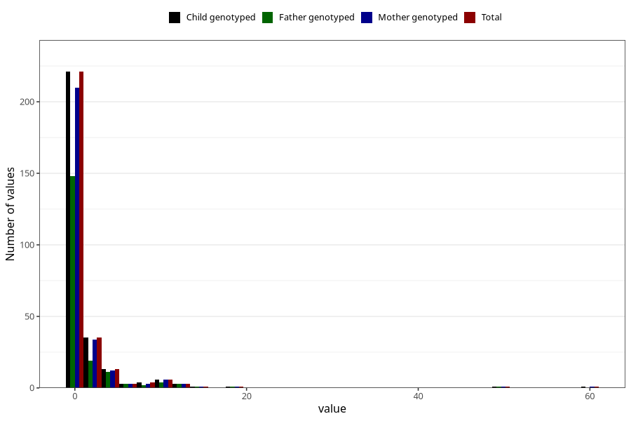

# other_convulsions_no_fever_number_12_18m
Variable mapping to `EE263` in `Skjema5_18mnd_v12`.
- Number of values:

| Value | Total | Child genotyped | Mother genotyped | Father genotyped |
| ----- | ----- | --------------- | ---------------- | ---------------- |
| Missing | 75017 | 75017 | 71373 | 49890 |
| Non-missing | 291 | 291 | 277 | 194 |
| Filled in text or mark instead of number | 2 | 2 | 2 |1 |
| 0 | 158 | 158 | 151 | 105 |
| 1 | 63 | 63 | 59 | 43 |
| 2 | 25 | 25 | 25 | 13 |
| 3 | 10 | 10 | 9 | 6 |
| 4 | 7 | 7 | 6 | 5 |
| 5 | 6 | 6 | 6 | 6 |
| 6 | 2 | 2 | 2 | 2 |
| 7 | 1 | 1 | 1 | 1 |
| 8 | 3 | 3 | 3 | 2 |
| 9 | 1 | 1 | 0 | 0 |
| 10 | 5 | 5 | 5 | 4 |
| 11 | 1 | 1 | 1 | 0 |
| 12 | 3 | 3 | 3 | 3 |
| 15 | 1 | 1 | 1 | 1 |
| 18 | 1 | 1 | 1 | 1 |
| 50 | 1 | 1 | 1 | 1 |
| 60 | 1 | 1 | 1 | 0 |

