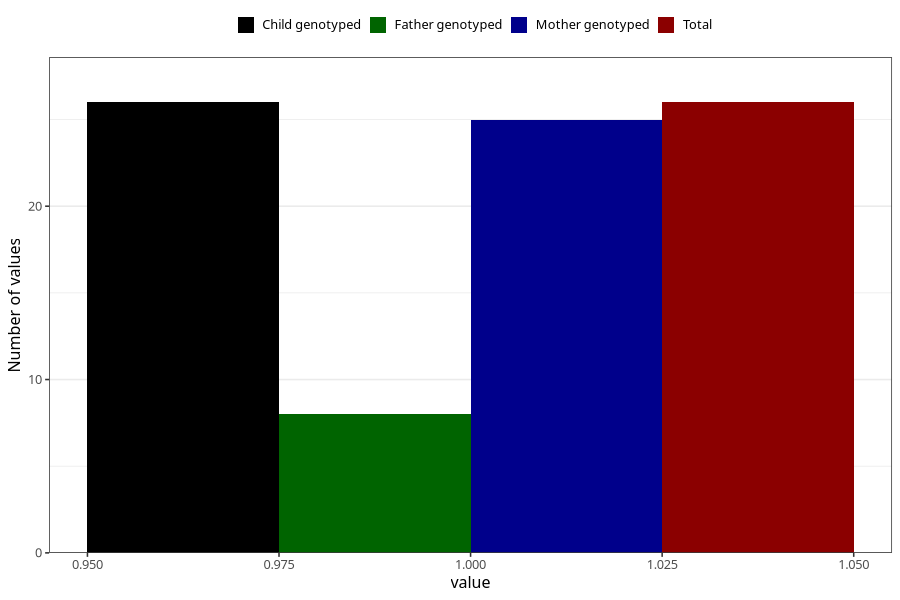

# other_gastrointestinal_problems_yes_3y
Variable mapping to `GG90` in `Skjema6_3aar_v12`.
- Number of values:

| Value | Total | Child genotyped | Mother genotyped | Father genotyped |
| ----- | ----- | --------------- | ---------------- | ---------------- |
| Missing | 75282 | 75282 | 71625 | 50076 |
| Non-missing | 26 | 26 | 25 | 8 |
| 1 | 26 | 26 | 25 | 8 |

