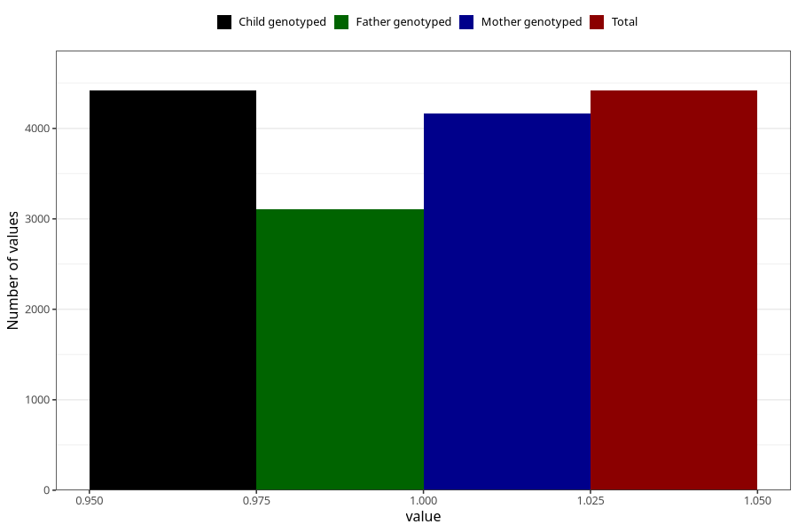

# specialist_diagnosis_1_18m
Variable mapping to `EE861` in `Skjema5_18mnd_v12`.
- Number of values:

| Value | Total | Child genotyped | Mother genotyped | Father genotyped |
| ----- | ----- | --------------- | ---------------- | ---------------- |
| Missing | 70890 | 70890 | 67482 | 46973 |
| Non-missing | 4418 | 4418 | 4168 | 3111 |
| 1 | 4418 | 4418 | 4168 | 3111 |

