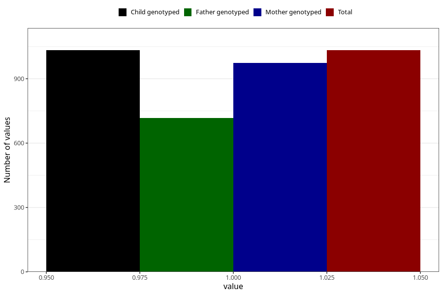

# specialist_diagnosis_2_18m
Variable mapping to `EE862` in `Skjema5_18mnd_v12`.
- Number of values:

| Value | Total | Child genotyped | Mother genotyped | Father genotyped |
| ----- | ----- | --------------- | ---------------- | ---------------- |
| Missing | 74275 | 74275 | 70676 | 49366 |
| Non-missing | 1033 | 1033 | 974 | 718 |
| 1 | 1033 | 1033 | 974 | 718 |

