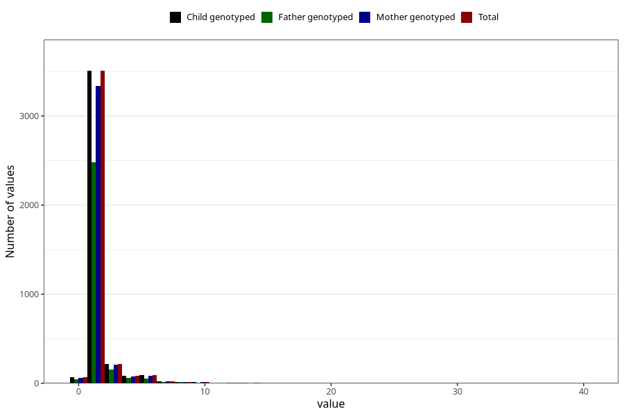

# throat_infection_confirmed_streptococci_freq_3y
Variable mapping to `GG132` in `Skjema6_3aar_v12`.
- Number of values:

| Value | Total | Child genotyped | Mother genotyped | Father genotyped |
| ----- | ----- | --------------- | ---------------- | ---------------- |
| Missing | 71286 | 71286 | 67827 | 47238 |
| Non-missing | 4022 | 4022 | 3823 | 2846 |
| 0 | 68 | 68 | 64 | 48 |
| 1 | 2844 | 2844 | 2716 | 2030 |
| 2 | 662 | 662 | 621 | 451 |
| 3 | 216 | 216 | 206 | 153 |
| 4 | 82 | 82 | 73 | 62 |
| 5 | 55 | 55 | 52 | 34 |
| 6 | 36 | 36 | 35 | 23 |
| 7 | 19 | 19 | 19 | 13 |
| 8 | 13 | 13 | 11 | 12 |
| 10 | 13 | 13 | 12 | 10 |
| 11 | 1 | 1 | 1 | 1 |
| 12 | 4 | 4 | 4 | 3 |
| 13 | 2 | 2 | 2 | 2 |
| 14 | 3 | 3 | 3 | 2 |
| 15 | 2 | 2 | 2 | 2 |
| 20 | 1 | 1 | 1 | 0 |
| 40 | 1 | 1 | 1 | 0 |

