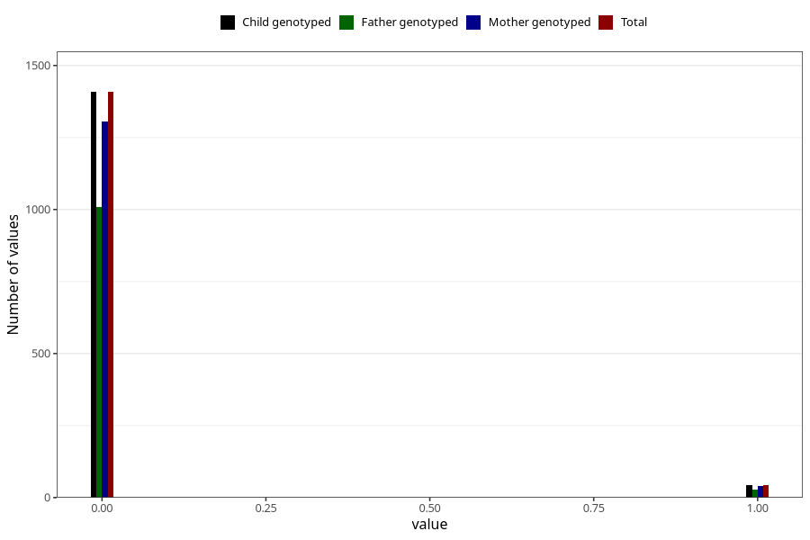

# trouble_relating_to_others_previous_3y
Variable mapping to `GG580` in `Skjema6_3aar_v12`.
- Number of values:

| Value | Total | Child genotyped | Mother genotyped | Father genotyped |
| ----- | ----- | --------------- | ---------------- | ---------------- |
| Missing | 73856 | 73856 | 70304 | 49047 |
| Non-missing | 1452 | 1452 | 1346 | 1037 |
| 0 | 1408 | 1408 | 1307 | 1009 |
| 1 | 44 | 44 | 39 | 28 |

