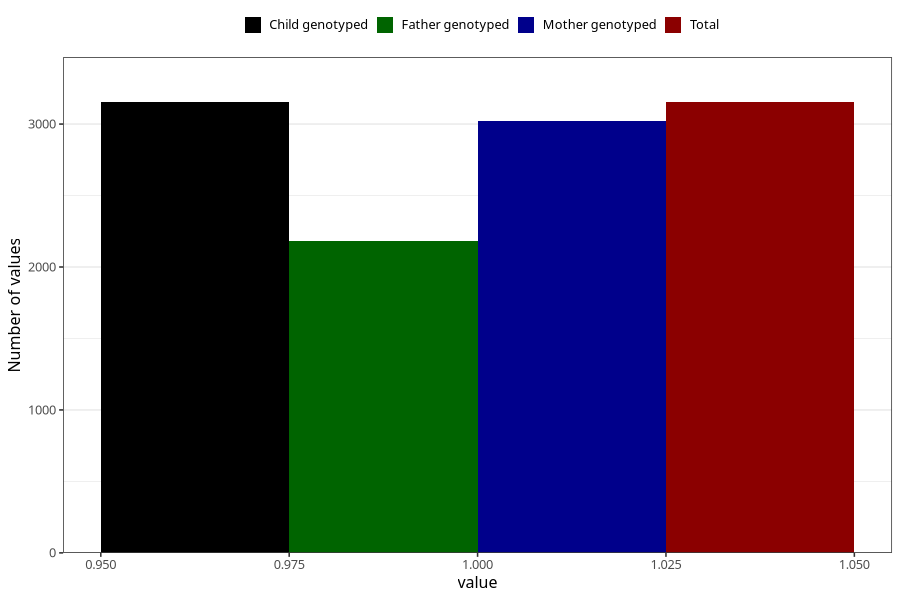

# formula_15_18m
Variable mapping to `EE19` in `Skjema5_18mnd_v12`.
- Number of values:

| Value | Total | Child genotyped | Mother genotyped | Father genotyped |
| ----- | ----- | --------------- | ---------------- | ---------------- |
| Missing | 72155 | 72155 | 68632 | 47900 |
| Non-missing | 3153 | 3153 | 3018 | 2184 |
| 1 | 3153 | 3153 | 3018 | 2184 |

