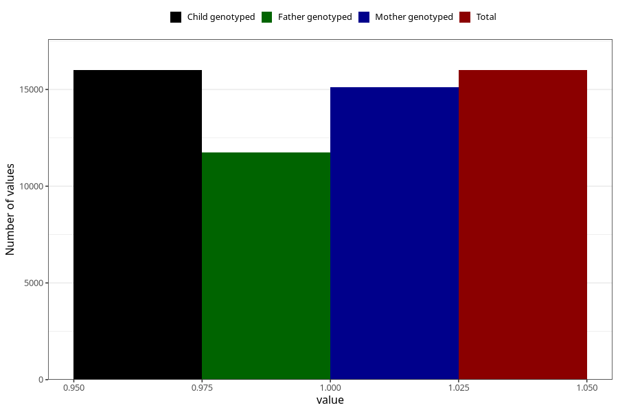

# omega3_liquid_5y
Variable mapping to `LL472` in `Skjema5aar_v12`.
- Number of values:

| Value | Total | Child genotyped | Mother genotyped | Father genotyped |
| ----- | ----- | --------------- | ---------------- | ---------------- |
| Missing | 59309 | 59309 | 56519 | 38338 |
| Non-missing | 15999 | 15999 | 15131 | 11746 |
| 1 | 15999 | 15999 | 15131 | 11746 |

