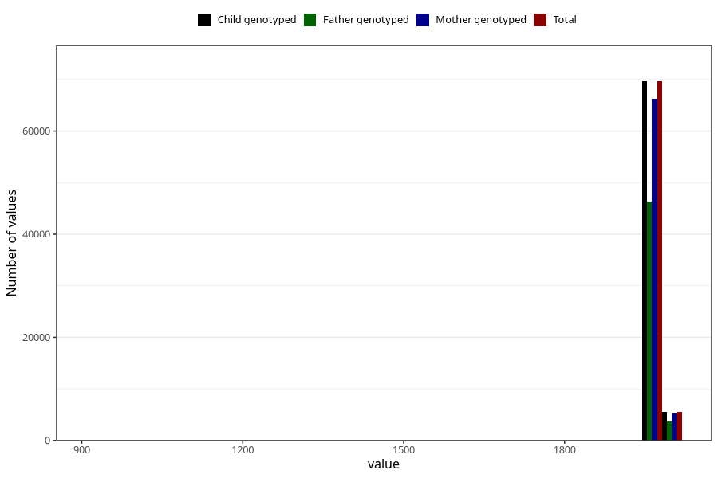

# mother_birth_year
Variable mapping to `mor_faar_trunkert` in `MFR_541_v12`.
- Number of values:

| Value | Total | Child genotyped | Mother genotyped | Father genotyped |
| ----- | ----- | --------------- | ---------------- | ---------------- |
| Missing | 61 | 61 | 57 | 40 |
| Non-missing | 75247 | 75247 | 71593 | 50044 |
| 25th percentile | 1971 | 1971 | 1971 | 1971 |
| 50th percentile | 1974 | 1974 | 1974 | 1975 |
| 75th percentile | 1978 | 1978 | 1978 | 1978 |
| Mean | 1973.96164631148 | 1973.96164631148 | 1973.91170924532 | 1974.27417872272 |
| Standard deviation | 20.448337576076 | 20.448337576076 | 20.934400369108 | 20.4300530346177 |
| N | 75247 | 75247 | 71593 | 50044 |

