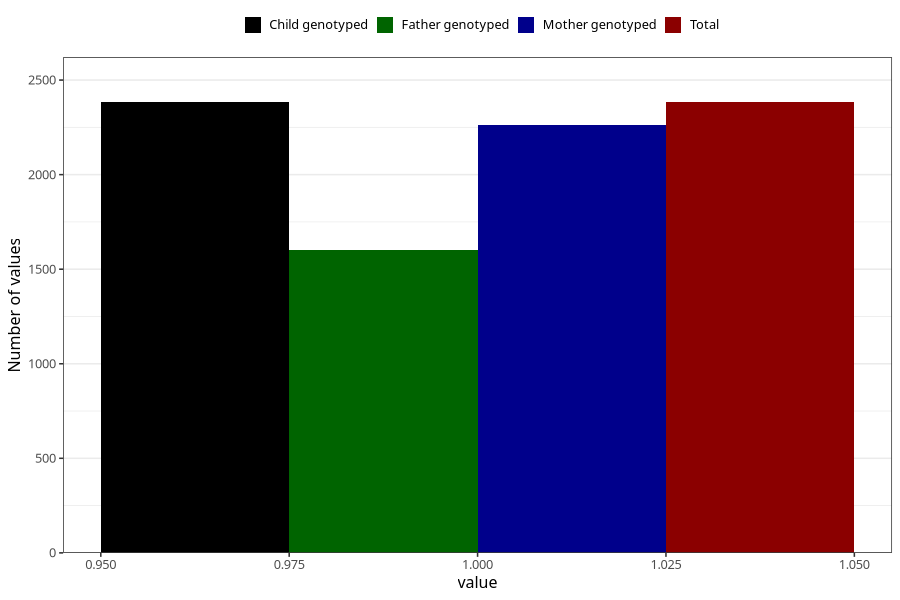

# asthma_during
Variable mapping to `AA420` in `Skjema1_v12`.
- Number of values:

| Value | Total | Child genotyped | Mother genotyped | Father genotyped |
| ----- | ----- | --------------- | ---------------- | ---------------- |
| Missing | 72925 | 72925 | 69388 | 48480 |
| Non-missing | 2383 | 2383 | 2262 | 1604 |
| 1 | 2383 | 2383 | 2262 | 1604 |

